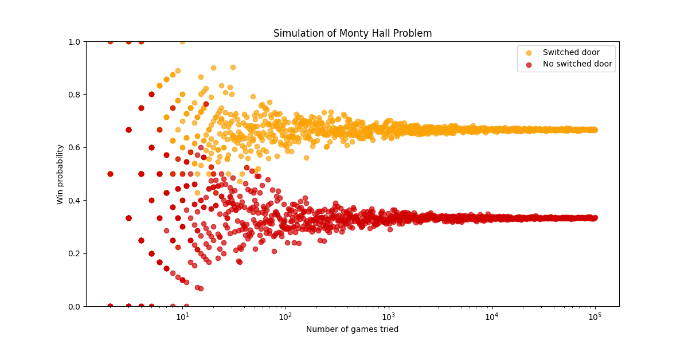

# Simulation of Monty Hall Problem with Python

Simulate the Monty Hall Problem by repeating the game thousands of times in order to calculate the win probability if we switch door or not
You can edit the file to change parameters and see how it works 

[monty_hall_problem.py](code/monty_hall_problem.py)

---

### Result of the simulation
We can see that switching doors after one is opened give a better chance to win the game and the probability to win tends to 2/3

---

# Other parameters

Then I asked myself how the game would work if we change the rules.

## Variation 1
Now there are 10 doors and only one of them is winning, the host can open 0 to 8 doors

[variation1.py](code/variation1.py)

### Result of the simulation
So it seems that the more you open doors, the higher is the chance to win which is very intuitive but the gap bewteen probabilities increase too

## Variation 2

There are 5 doors and two of them are winning, the host open 0 to 3 doors

[variation2.py](code/variation2.py)

### Result of the simulation
We can see that the win probability still increase but it is not equal to 0.5 when we open 1 door (it is ~0.54)

## General case

Now we can try to adapt the previous experiments by trying to understand how this work with all the parameters as variables

[general_case.py](code/general_case.py)

By doing some maths, we get the winning probability equal to (n_winnning(n_doors-1))/(n_doors(n_doors-n_open-1)) 

### Result of the experiment
We compare the result of the simulation with the theoric probability with different situations

So it seems that the theroric calculation is not connected to simulation (when a lot of doors are opened), so there is a mistake in the code or the calculation ...

