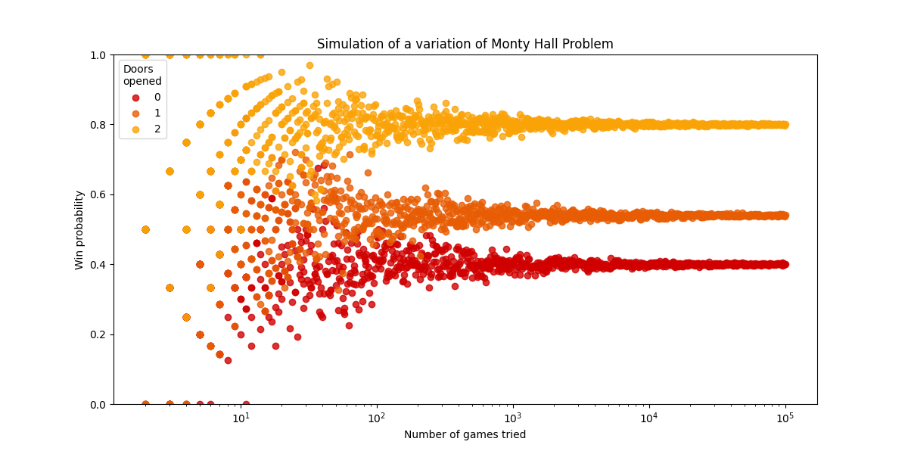

# Simulation of Monty Hall Problem with Python

Simulate the Monty Hall Problem by repeating the game thousands of times in order to calculate the win probability if we switch door or not
You can edit the file to change parameters and see how it works

---

### Result of the simulation
We can see that switching doors after one is opened give a better chance to win the game and the probability to win tends to 2/3

---

# Other parameters

Then I asked myself how the game would work if we change the rules.

## Variation 1
Now there are 10 doors and only one of them is winning, the host can open 0 to 8 doors

### Result of the simulation
So it seems that the win probabilty tends to (1+ number of doors opened)/10

## Variation 2

There are 5 doors and two of them are winning, the host open 0 to 3 doors

### Result of the simulation
We can see that the win probability tends to (2 + number of opened doors) / 5

## General case

Now we can try to adapt the previous experiments by trying to understand how this work with more variables

By doing some maths, we get the winning probability equal to (n_winnning(n_doors-1))/(n_doors(n_doors-n_open-1)) 

### Result of the experiment
We compare the result of the simulation with the theoric probability with different situations
So it seems that the theroric calculation is connected to result of the simulation

